# Проектирование базы данных «Окколо» — ER-диаграмма и описание

> Материал для главы 2 диплома (раздел «Проектирование базы данных»). Диаграммы — на Mermaid
> (нотация Crow's Foot), построены по 18 файлам `schema.json` CMS `okkolo-cms`.
> Нумерация подразделов (2.3.x) условна — подставить под структуру своей главы.
>
> Приведены **две версии** одной и той же схемы:
> - **Упрощённая (логическая модель)** — основной рисунок для диплома. Медиа-связи показаны как
>   прямые FK от сущностей контента к таблице файлов `FILE`. Это соответствует уровню «логической
>   модели» (даталогической): на нём допустимо абстрагироваться от способа реализации связи.
> - **Полная (с физической реализацией медиа-подсистемы)** — дополнительная иллюстрация, показывает,
>   что физически Strapi реализует все медиа-связи через одну системную полиморфную таблицу
>   `FILES_RELATED_MORPH`. Уместна как рисунок в приложении или как комментарий к основной диаграмме.

## ER-диаграмма (Mermaid). Упрощённая версия — логическая модель

```mermaid
erDiagram
    %% ============================================================
    %% ER-диаграмма БД ИС «Окколо» — упрощённая (логическая) версия.
    %% Медиа-связи показаны как прямые FK от сущностей контента к
    %% таблице FILE (как в классической реляционной модели).
    %% Полиморфная связующая таблица скрыта — см. полную версию ниже.
    %% Нотация Crow's Foot (Мартина / IE), уровень — логический.
    %% ============================================================

    %% ---------- ГРУППА 1. Каталог и контент ----------
    DIRECTION {
        int id PK "первичный ключ"
        string title "название направления"
        text description "описание"
        string href "soft-ссылка на путь фронта"
        int image_id FK "→ FILE"
    }

    EVENT {
        int id PK "первичный ключ"
        string title "название мероприятия"
        uid slug UK "ЧПУ-идентификатор для /events/<slug>"
        datetime date "дата и время"
        enum type "музыка|мастер-класс|лекция|стенд-ап"
        boolean isPaid "признак платности"
        int price "цена, ₽"
        string paymentUrl "ссылка на оплату"
        int spotsTotal "всего мест"
        int spotsTaken "занято мест"
        int photo_id FK "обложка → FILE"
        int gallery_ids FK "галерея → FILE (multiple)"
    }

    PRODUCT {
        int id PK "первичный ключ"
        string title "название товара"
        int price "цена, ₽"
        enum category "ceramics|clothing|jewelry|textile"
        boolean isAvailable "в наличии"
        string cartUrl "внешняя ссылка корзины"
        int image_id FK "фото → FILE (обязательно)"
        int gallery_ids FK "галерея → FILE (multiple)"
    }

    MENU_ITEM {
        int id PK "первичный ключ"
        string name "название позиции"
        string volume "объём"
        string price "цена строкой (вилка)"
        string note "примечание"
        enum category "coffee|tea|signature|topping|cold|lemonade"
        enum season "main|summer|winter"
        int order "порядок вывода"
        boolean isAvailable "доступность"
    }

    WORKSHOP_PROGRAM {
        int id PK "первичный ключ"
        string title "название программы"
        text description "описание"
        int order "порядок вывода"
        int image_id FK "фото → FILE"
    }

    %% ---------- ГРУППА 2. Отчётность и документы ----------
    MONTHLY_REPORT {
        int id PK "первичный ключ"
        int month "месяц (1..12)"
        int year "год (2020..2100)"
        text summary "краткое содержание"
        int pdf_id FK "PDF → FILE"
    }

    ANNUAL_REPORT {
        int id PK "первичный ключ"
        int year "год (2020..2100)"
        enum kind "content|finance|nko-activity|spending"
        text note "примечание"
        int pdf_id FK "PDF → FILE"
    }

    LEGAL_DOCUMENT {
        int id PK "первичный ключ"
        string title "название документа"
        enum category "requisites|foundation|privacy"
        int order "порядок вывода"
        int pdf_id FK "PDF → FILE"
    }

    %% ---------- ГРУППА 3. Страницы и фото ----------
    ABOUT_PAGE {
        int id PK "первичный ключ"
        string eyebrow "надзаголовок"
        string title "заголовок"
        text lead "лид-абзац"
        string tagline "слоган"
        int heroPhoto_id FK "герой-фото → FILE"
        string heroPhotoAlt "alt-текст"
    }

    ACCESSIBILITY_PAGE {
        int id PK "первичный ключ"
        string title "заголовок"
        text lead "лид-абзац"
        int heroPhoto_id FK "герой-фото → FILE"
        string heroPhotoAlt "alt-текст"
    }

    CAFE_MENU_PAGE {
        int id PK "первичный ключ"
        int mainPosterImage_id FK "основной постер → FILE"
        string mainPosterAlt "alt основного постера"
        int summerPosterImage_id FK "летний постер → FILE"
        string summerPosterAlt "alt летнего постера"
        string footnote "сноска"
    }

    WORKSHOPS_PAGE {
        int id PK "первичный ключ"
        text intro "вступление"
        text audienceText "для кого"
        text audienceNote "уточнение по аудитории"
        text afterIntro "после вступления"
        int audiencePhoto_id FK "фото аудитории → FILE"
        int afterLearningPhoto_id FK "фото «после» → FILE"
    }

    ABOUT_TEAM_PHOTO {
        int id PK "первичный ключ"
        string alt "alt-текст"
        string caption "подпись"
        int order "порядок"
        int image_id FK "фото → FILE (обязательно)"
    }

    ABOUT_WORKPLACE_PHOTO {
        int id PK "первичный ключ"
        string alt "alt-текст"
        string caption "подпись"
        int order "порядок"
        int image_id FK "фото → FILE (обязательно)"
    }

    SHOWROOM {
        int id PK "первичный ключ"
        int heroImage_id FK "герой-фото витрины → FILE"
    }

    %% ---------- ГРУППА 4. Заявки пользователей (транзакционные) ----------
    EVENT_REGISTRATION {
        int id PK "первичный ключ"
        string eventId "SOFT-КЛЮЧ → EVENT (строка, не FK)"
        string eventTitle "денормализованная копия заголовка"
        string name "имя (обязательно)"
        string phone "телефон (обязательно)"
        email email "e-mail"
        text comment "комментарий"
        enum paymentStatus "pending|not_required|paid"
    }

    WORKSHOP_APPLICATION {
        int id PK "первичный ключ"
        string name "имя (обязательно)"
        enum contactMethod "phone|email (обязательно, default phone)"
        string phone "телефон"
        email email "e-mail"
        enum status "pending|contacted|rejected (default pending)"
    }

    ORDER {
        int id PK "первичный ключ"
        string customerName "имя покупателя (обязательно)"
        string phone "телефон (обязательно)"
        email email "e-mail"
        int itemsSubtotal "сумма товаров, ₽"
        int deliveryPrice "стоимость доставки, ₽"
        int totalPrice "итог, ₽"
        json items "СОСТАВ-СНИМОК → PRODUCT (JSON, не FK)"
        enum orderStatus "pending|completed"
        enum fulfillmentType "pickup|delivery"
        string city "город"
        string address "адрес"
        text deliveryComment "комментарий к доставке"
    }

    %% ---------- ТАБЛИЦА ФАЙЛОВ ----------
    FILE {
        int id PK "первичный ключ"
        string name "имя файла"
        string url "URL в public/uploads"
        string mime "MIME-тип"
        json formats "адаптивные форматы"
    }

    %% ============================================================
    %% СВЯЗИ
    %% ============================================================

    %% Прямые медиа-связи (FK к таблице FILE).
    %% Физически реализованы через системную полиморфную таблицу
    %% files_related_morphs — см. полную версию диаграммы.
    DIRECTION             }o--o| FILE : "image"
    EVENT                 }o--o| FILE : "photo"
    EVENT                 }o--o{ FILE : "gallery"
    PRODUCT               }o--|| FILE : "image"
    PRODUCT               }o--o{ FILE : "gallery"
    WORKSHOP_PROGRAM      }o--o| FILE : "image"
    MONTHLY_REPORT        }o--|| FILE : "pdf"
    ANNUAL_REPORT         }o--|| FILE : "pdf"
    LEGAL_DOCUMENT        }o--|| FILE : "pdf"
    ABOUT_PAGE            }o--o| FILE : "heroPhoto"
    ACCESSIBILITY_PAGE    }o--o| FILE : "heroPhoto"
    CAFE_MENU_PAGE        }o--o| FILE : "mainPosterImage"
    CAFE_MENU_PAGE        }o--o| FILE : "summerPosterImage"
    WORKSHOPS_PAGE        }o--o| FILE : "audiencePhoto"
    WORKSHOPS_PAGE        }o--o| FILE : "afterLearningPhoto"
    ABOUT_TEAM_PHOTO      }o--|| FILE : "image"
    ABOUT_WORKPLACE_PHOTO }o--|| FILE : "image"
    SHOWROOM              }o--o| FILE : "heroImage"

    %% Логические (soft) связи домена: НЕ закреплены внешним ключом.
    EVENT   ||..o{ EVENT_REGISTRATION : "eventId (soft-ключ, snapshot)"
    PRODUCT ||..o{ ORDER : "items JSON (snapshot, не FK)"
```

## ER-диаграмма (Mermaid). Полная версия — с физической реализацией медиа

```mermaid
erDiagram
    %% ============================================================
    %% ER-диаграмма БД информационной системы «Окколо»
    %% Нотация Crow's Foot (Мартина / IE), уровень — логический.
    %% Идентификаторы латиницей (требование Mermaid); русские
    %% подписи сущностей даны в комментариях и в тексте описания.
    %% Медиа-поля показаны с реальными именами из schema.json (тип media)
    %% и помечены FK — логическая связь с подсистемой файлов (см. описание).
    %% ============================================================

    %% ---------- ГРУППА 1. Каталог и контент ----------
    DIRECTION {
        int id PK "первичный ключ"
        string title "название направления"
        text description "описание"
        string href "soft-ссылка на путь фронта (НЕ relation)"
        media image FK "→ FILE (upload)"
    }

    EVENT {
        int id PK "первичный ключ"
        string title "название мероприятия"
        uid slug UK "ЧПУ-идентификатор для /events/<slug>"
        datetime date "дата и время"
        enum type "музыка|мастер-класс|лекция|стенд-ап"
        boolean isPaid "признак платности"
        int price "цена, ₽"
        string paymentUrl "ссылка на оплату"
        int spotsTotal "всего мест"
        int spotsTaken "занято мест"
        media photo FK "обложка → FILE"
        media gallery FK "галерея → FILE (multiple)"
    }

    PRODUCT {
        int id PK "первичный ключ"
        string title "название товара"
        int price "цена, ₽"
        enum category "ceramics|clothing|jewelry|textile"
        boolean isAvailable "в наличии"
        string cartUrl "внешняя ссылка корзины"
        media image FK "фото → FILE (обязательно)"
        media gallery FK "галерея → FILE (multiple)"
    }

    MENU_ITEM {
        int id PK "первичный ключ"
        string name "название позиции"
        string volume "объём"
        string price "цена строкой (вилка)"
        string note "примечание"
        enum category "coffee|tea|signature|topping|cold|lemonade"
        enum season "main|summer|winter"
        int order "порядок вывода"
        boolean isAvailable "доступность"
    }

    WORKSHOP_PROGRAM {
        int id PK "первичный ключ"
        string title "название программы"
        text description "описание"
        int order "порядок вывода"
        media image FK "фото → FILE"
    }

    %% ---------- ГРУППА 2. Отчётность и документы ----------
    MONTHLY_REPORT {
        int id PK "первичный ключ"
        int month "месяц (1..12)"
        int year "год (2020..2100)"
        text summary "краткое содержание"
        media pdf FK "PDF → FILE"
    }

    ANNUAL_REPORT {
        int id PK "первичный ключ"
        int year "год (2020..2100)"
        enum kind "content|finance|nko-activity|spending"
        text note "примечание"
        media pdf FK "PDF → FILE"
    }

    LEGAL_DOCUMENT {
        int id PK "первичный ключ"
        string title "название документа"
        enum category "requisites|foundation|privacy"
        int order "порядок вывода"
        media pdf FK "PDF → FILE"
    }

    %% ---------- ГРУППА 3. Страницы и фото (single types + фото-коллекции) ----------
    ABOUT_PAGE {
        int id PK "первичный ключ"
        string eyebrow "надзаголовок"
        string title "заголовок"
        text lead "лид-абзац"
        string tagline "слоган"
        media heroPhoto FK "герой-фото → FILE"
        string heroPhotoAlt "alt-текст"
    }

    ACCESSIBILITY_PAGE {
        int id PK "первичный ключ"
        string title "заголовок"
        text lead "лид-абзац"
        media heroPhoto FK "герой-фото → FILE"
        string heroPhotoAlt "alt-текст"
    }

    CAFE_MENU_PAGE {
        int id PK "первичный ключ"
        media mainPosterImage FK "основной постер → FILE"
        string mainPosterAlt "alt основного постера"
        media summerPosterImage FK "летний постер → FILE"
        string summerPosterAlt "alt летнего постера"
        string footnote "сноска"
    }

    WORKSHOPS_PAGE {
        int id PK "первичный ключ"
        text intro "вступление"
        text audienceText "для кого"
        text audienceNote "уточнение по аудитории"
        text afterIntro "после вступления"
        media audiencePhoto FK "фото аудитории → FILE"
        media afterLearningPhoto FK "фото «после» → FILE"
    }

    ABOUT_TEAM_PHOTO {
        int id PK "первичный ключ"
        string alt "alt-текст"
        string caption "подпись"
        int order "порядок"
        media image FK "фото → FILE (обязательно)"
    }

    ABOUT_WORKPLACE_PHOTO {
        int id PK "первичный ключ"
        string alt "alt-текст"
        string caption "подпись"
        int order "порядок"
        media image FK "фото → FILE (обязательно)"
    }

    SHOWROOM {
        int id PK "первичный ключ"
        media heroImage FK "герой-фото витрины → FILE"
    }

    %% ---------- ГРУППА 4. Заявки пользователей (транзакционные) ----------
    EVENT_REGISTRATION {
        int id PK "первичный ключ"
        string eventId "SOFT-КЛЮЧ → EVENT (строка, не FK)"
        string eventTitle "денормализованная копия заголовка"
        string name "имя (обязательно)"
        string phone "телефон (обязательно)"
        email email "e-mail"
        text comment "комментарий"
        enum paymentStatus "pending|not_required|paid"
    }

    WORKSHOP_APPLICATION {
        int id PK "первичный ключ"
        string name "имя (обязательно)"
        enum contactMethod "phone|email (обязательно, default phone)"
        string phone "телефон"
        email email "e-mail"
        enum status "pending|contacted|rejected (default pending)"
    }

    ORDER {
        int id PK "первичный ключ"
        string customerName "имя покупателя (обязательно)"
        string phone "телефон (обязательно)"
        email email "e-mail"
        int itemsSubtotal "сумма товаров, ₽"
        int deliveryPrice "стоимость доставки, ₽"
        int totalPrice "итог, ₽"
        json items "СОСТАВ-СНИМОК → PRODUCT (JSON, не FK)"
        enum orderStatus "pending|completed"
        enum fulfillmentType "pickup|delivery"
        string city "город"
        string address "адрес"
        text deliveryComment "комментарий к доставке"
    }

    %% ---------- ПОДСИСТЕМА МЕДИА (Strapi Upload) ----------
    FILE {
        int id PK "первичный ключ"
        string name "имя файла"
        string url "URL в public/uploads"
        string mime "MIME-тип"
        json formats "адаптивные форматы"
    }

    FILES_RELATED_MORPH {
        int id PK "первичный ключ"
        int file_id FK "→ FILE"
        int related_id "id связанной записи (полиморфно)"
        string related_type "тип связанной сущности (полиморфно)"
        string field "имя медиа-поля"
        int order "порядок в multiple-поле"
    }

    %% ============================================================
    %% СВЯЗИ
    %% ============================================================

    %% --- Единственная enforced-связь БД: полиморфная медиа-подсистема ---
    FILE ||--o{ FILES_RELATED_MORPH : "связывается через"

    %% Полиморфные (неидентифицирующие) медиа-связи контент-сущностей → FILE.
    %% Реализованы upload-плагином через FILES_RELATED_MORPH (related_type/related_id),
    %% поэтому это неидентифицирующие связи (пунктир ..).
    DIRECTION             }o..o| FILE : "image"
    EVENT                 }o..o{ FILE : "photo / gallery"
    PRODUCT               }o..o{ FILE : "image / gallery"
    WORKSHOP_PROGRAM      }o..o| FILE : "image"
    MONTHLY_REPORT        }o..|| FILE : "pdf"
    ANNUAL_REPORT         }o..|| FILE : "pdf"
    LEGAL_DOCUMENT        }o..|| FILE : "pdf"
    ABOUT_PAGE            }o..o| FILE : "heroPhoto"
    ACCESSIBILITY_PAGE    }o..o| FILE : "heroPhoto"
    CAFE_MENU_PAGE        }o..o{ FILE : "main / summer poster"
    WORKSHOPS_PAGE        }o..o{ FILE : "audience / afterLearning photo"
    ABOUT_TEAM_PHOTO      }o..|| FILE : "image"
    ABOUT_WORKPLACE_PHOTO }o..|| FILE : "image"
    SHOWROOM              }o..o| FILE : "heroImage"

    %% --- Логические (soft) связи домена: НЕ закреплены внешним ключом ---
    %% Неидентифицирующие (пунктир), реализованы строкой / JSON-снимком.
    EVENT   ||..o{ EVENT_REGISTRATION : "eventId (soft-ключ, snapshot)"
    PRODUCT ||..o{ ORDER : "items JSON (snapshot, не FK)"
```

---

# 2.3. Проектирование базы данных

## 2.3.1. Назначение раздела и выбор СУБД

Для хранения данных информационной системы «Окколо» я спроектировала реляционную базу данных, работающую под управлением СУБД PostgreSQL 16 на промышленном сервере (в среде разработки используется SQLite — файл `.tmp/data.db`, переключение драйвера выполняется переменной `DATABASE_CLIENT`). Проектирование я вела последовательно от концептуального уровня к физическому: сначала описала семантику предметной области (инфологическая модель), затем отобразила её на реляционную модель с первичными и внешними ключами (даталогическая модель) и, наконец, перешла к физической реализации средствами headless-CMS Strapi 5, которая генерирует таблицы PostgreSQL из описаний сущностей. Структура базы данных представлена ER-диаграммой на рисунке N (нотация Crow's Foot). Для удобства восприятия диаграмма приведена в двух взаимно согласованных видах: упрощённой (логическая модель, рисунок N) — основная иллюстрация раздела, на которой медиа-связи отображены как прямые внешние ключи к таблице файлов, и полной (рисунок N+1) — с детализацией системной полиморфной таблицы `files_related_morphs`, через которую медиа-связи реализованы физически в Strapi.

Схема как код. Особенность выбранного стека в том, что я не писала SQL-миграции вручную: каждый тип контента описан декларативно в файле `schema.json` (всего 18 описаний, версионируются в Git), а Strapi при старте сам приводит структуру таблиц PostgreSQL к этим описаниям. Тем самым логическая модель и физическая схема всегда синхронизированы, а ER-диаграмма построена непосредственно по этим `schema.json` (имена сущностей и атрибутов на диаграмме соответствуют декларациям; для читаемости опущены вспомогательные alt- и служебные поля).

## 2.3.2. Уровень модели и обоснование нотации

На рисунке N изображена логическая (даталогическая) модель: сущности преобразованы в таблицы (отношения), атрибуты — в столбцы с типами, явно выделены первичные ключи (PK), внешние ключи к подсистеме медиа (FK) и уникальный ключ (UK) `slug` у мероприятия. Я выбрала нотацию Crow's Foot (нотацию Мартина, она же IE-нотация) по трём причинам: она компактна и размещает атрибуты и ключи прямо внутри прямоугольника-сущности; наглядно кодирует кардинальность и обязательность участия концами линий; и согласована со средством построения диаграммы (Mermaid `erDiagram` поддерживает именно Crow's Foot), что исключает расхождение между рисунком и текстом.

## 2.3.3. Перечень сущностей

В ходе проектирования я выделила 18 сущностей, которые по назначению объединяются в четыре смысловые группы плюс системную подсистему медиа. По способу хранения они делятся на коллекции (множество записей, 14 шт.) и одиночные типы (single type, ровно одна запись на сайт, 4 шт.).

| Сущность (таблица) | Назначение | Вид |
|---|---|---|
| `directions` — Направление | Карточки направлений кластера (кофейня, мастерские, шоурум, события) | коллекция |
| `events` — Мероприятие | Афиша событий: концерты, лекции, мастер-классы, стендап | коллекция |
| `products` — Товар | Каталог шоурума (керамика, одежда, украшения, текстиль) | коллекция |
| `menu_items` — Позиция меню | Позиции меню кофейни (сгруппированы по категории и сезону) | коллекция |
| `workshop_programs` — Программа мастерской | Описания программ мастерских | коллекция |
| `monthly_reports` — Ежемесячный отчёт | Отчётность НКО по месяцам (PDF) | коллекция |
| `annual_reports` — Годовой отчёт | Годовая отчётность по виду (контент/финансы/деятельность/расходы) | коллекция |
| `legal_documents` — Юридический документ | Реквизиты, уставные и приватность (PDF) | коллекция |
| `about_team_photos` — Фото команды | Галерея команды на странице «О нас» | коллекция |
| `about_workplace_photos` — Фото пространства | Галерея пространства | коллекция |
| `event_registrations` — Заявка на мероприятие | Регистрации пользователей на события | коллекция |
| `workshop_applications` — Заявка на мастерскую | Заявки на обратный звонок по мастерским (имя, способ связи, статус обработки) | коллекция |
| `orders` — Заказ | Заказы из шоурума (самовывоз/доставка) | коллекция |
| `showrooms` — Шоурум | Hero-изображение витрины | коллекция |
| `about_pages` — Страница «О нас» | Контент страницы | single type |
| `accessibility_pages` — Страница «Доступность» | Контент страницы | single type |
| `cafe_menu_pages` — Меню кофейни (постеры) | Изображения-постеры меню | single type |
| `workshops_pages` — Страница «Мастерские» | Текст и фото страницы | single type |

Содержательным ядром предметной области являются три транзакционно значимые сущности — `events`, `products` и порождаемые ими заявки `event_registrations`, `workshop_applications` и заказы `orders`; остальные сущности обслуживают контент сайта и отчётность фонда.

## 2.3.4. Первичные ключи и атрибуты

Во всех сущностях я применила суррогатный первичный ключ — целочисленный автоинкрементный `id`, который генерирует СУБД. Суррогатный ключ выбран сознательно: он стабилен (не меняется при правке бизнес-данных), компактен, ускоряет индексацию и не раскрывает бизнес-смысл, тогда как естественные кандидаты (телефон, e-mail) во времени не уникальны и могут меняться. Дополнительно у мероприятия задан уникальный ключ (UK) — поле `slug` типа `uid` (генерируется из `title`), которое обеспечивает человекочитаемый URL `/events/<slug>` и гарантирует отсутствие коллизий адресов.

Для иллюстрации опишу атрибуты двух центральных сущностей.

Сущность `events` (Мероприятие):

| Поле | Тип | Назначение | Ограничения |
|---|---|---|---|
| `id` | integer | идентификатор | PK, NOT NULL |
| `title` | varchar | название | NOT NULL |
| `slug` | uid | адрес `/events/<slug>` | UK |
| `date` | datetime | дата и время | — |
| `type` | enum | музыка / мастер-класс / лекция / стенд-ап | — |
| `isPaid` | boolean | платность | default false |
| `price` | integer | цена, ₽ | — |
| `spotsTotal`, `spotsTaken` | integer | всего мест / занято | — |
| `photo`, `gallery` | media | обложка и галерея | FK → `files` (upload) |

Сущность `orders` (Заказ):

| Поле | Тип | Назначение | Ограничения |
|---|---|---|---|
| `id` | integer | идентификатор | PK, NOT NULL |
| `customerName`, `phone` | varchar | контакты покупателя | NOT NULL |
| `email` | email | e-mail | — |
| `itemsSubtotal`, `deliveryPrice`, `totalPrice` | integer | денежные итоги, ₽ | — |
| `items` | json | состав заказа (снимок позиций) | — |
| `orderStatus` | enum | pending / completed | — |
| `fulfillmentType` | enum | pickup / delivery | — |
| `city`, `address`, `deliveryComment` | varchar / text | параметры доставки | — |

Перечисляемые типы (`enum`) я применила там, где множество значений фиксировано предметной областью и должно контролироваться на уровне схемы: тип мероприятия, категория и сезон позиции меню, категория товара, категория юридического документа, вид годового отчёта, статус заказа и заявки, способ выдачи заказа. Это аналог CHECK-ограничения: СУБД не примет значение вне списка (физически `enum` хранится строковым столбцом `varchar` с ограничением допустимых значений).

Кроме описанных в схеме столбцов, у каждой таблицы Strapi автоматически заводит служебные поля: `created_at`, `updated_at`, а в режиме черновик/публикация — `published_at` и `document_id` (строковый идентификатор документа, общий для черновой и опубликованной версий записи). Этот режим (`draftAndPublish: true`) включён у всех 18 типов: редактор готовит контент как черновик и публикует отдельным действием, не затрагивая опубликованную версию.

## 2.3.5. Связи и кардинальность

Ключевая особенность спроектированной схемы, которую я отдельно проговариваю, состоит в следующем: между содержательными сущностями нет ни одной реляционной связи, закреплённой внешним ключом на уровне СУБД. Это проверяемый факт — в 18 файлах `schema.json` нет ни одного поля типа `relation`. Единственная связь, закреплённая внешним ключом в базе, — это связь любой контент-сущности с подсистемой медиа. Смысловые же связи домена реализованы «мягко» — строковыми ключами и JSON-снимками. Ниже я обосновываю каждую связь.

1. Подсистема медиа (enforced FK, полиморфная связь). Все изображения и PDF хранятся стандартным механизмом Strapi Upload, а не собственными таблицами. Физически это две системные таблицы: `files` (метаданные загруженного файла — имя, URL, MIME, адаптивные форматы) и полиморфная связующая таблица `files_related_morph` (поля `file_id`, `related_id`, `related_type`, `field`, `order`). Между ними связь один-ко-многим: `FILE ||--o{ FILES_RELATED_MORPH` — один файл может быть привязан к нескольким записям, каждая строка связующей таблицы ссылается ровно на один файл. От любого медиа-поля сущности (помечено FK на диаграмме) к `files` ведёт полиморфная неидентифицирующая связь: пара `related_type` + `related_id` указывает, к какой сущности и записи относится файл, поле `field` — к какому именно атрибуту, поле `order` упорядочивает элементы в множественных галереях (`event.gallery`, `product.gallery`, `multiple: true`). Эта связь — единственная enforced-связь в базе помимо служебных, и именно поэтому только она нарисована сплошной линией к связующей таблице. Важно: на диаграмме медиа-поля показаны как FK для наглядности логической модели; физически в таблице контента отдельного столбца-ключа нет — привязка хранится в полиморфной таблице. Соответственно, на основной (упрощённой) диаграмме связь от сущности к `FILE` изображена напрямую — это соответствует уровню логической модели и не искажает смысла: тип связи (полиморфный или классический) — деталь физической реализации, которая показана отдельно на полной версии диаграммы.

2. Мероприятие — Заявка на мероприятие (логическая 1:N, soft-ключ). Связь `EVENT ||..o{ EVENT_REGISTRATION` по смыслу — один-ко-многим: на одно мероприятие может быть подано ноль или несколько заявок, а каждая заявка относится к одному мероприятию. Однако внешнего ключа здесь нет: заявка хранит идентификатор события в строковом поле `eventId` (soft-ключ) и денормализованную копию названия в `eventTitle`. Дополнительная тонкость: первичный ключ мероприятия `events.id` — целочисленный, а `eventId` в заявке — строковый, поэтому прямого SQL-`JOIN` между таблицами по этим полям by design нет; при необходимости сопоставление выполняется на стороне приложения с приведением типа. На диаграмме связь показана пунктиром (неидентифицирующая, не закреплённая FK). Это решение я приняла осознанно — см. 2.3.6.

3. Товар — Заказ (логическая 1:N через JSON-снимок). Связь `PRODUCT ||..o{ ORDER`: один товар может входить в ноль или несколько заказов. В реляционном смысле «заказ — товар» — это связь многие-ко-многим (в одном заказе несколько товаров, один товар в нескольких заказах), которая классически разрешается ассоциативной таблицей «позиции заказа» (`order_items`) с составным ключом и атрибутами связи (количество, цена). Я сознательно отказалась от такой таблицы: состав заказа сериализуется в JSON-поле `orders.items` массивом объектов `{ productId, title, price, quantity, image }`, а денежные итоги (`itemsSubtotal`, `deliveryPrice`, `totalPrice`) вынесены плоскими полями записи. Связь логическая, без FK, на диаграмме — пунктир.

4. Заявка на мастерскую — изолированная сущность без связей. Сущность `workshop_applications` хранит обратные звонки по мастерским и сознательно не связана ни с `workshop_programs`, ни с какой-либо иной таблицей: форма «перезвоните» обслуживает все программы целиком, не привязывая заявку к конкретной мастерской — заявитель оставляет имя и способ связи (`contactMethod`: телефон или e-mail), а оператор сам уточняет интересующую программу при звонке. Поэтому на ER-диаграмме у `WORKSHOP_APPLICATION` нет ни одной входящей или исходящей связи, кроме обязательных служебных. Поле `status` (`pending` / `contacted` / `rejected`) фиксирует стадию обработки на стороне администратора.

5. Связи через значения (без рёбер). Группировки на сайте я реализовала не связями, а значениями полей: годовые отчёты группируются по паре `year` + `kind`, юридические документы — по `category`, позиции меню — по `category` + `season`. Аналогично `direction.href` — это не связь на сущность, а строка-маршрут фронта (`/cafe`, `/showroom`, `/workshops`, `/events`). Прямой связи `product ↔ showroom` тоже нет: витрина собирается на стороне клиента из двух независимых запросов.

## 2.3.6. Нормализация и осознанная денормализация

Справочные (контентные) сущности — `directions`, `events`, `products`, `menu_items`, отчёты и страницы — приведены к третьей нормальной форме. 1НФ соблюдена: все скалярные атрибуты атомарны, повторяющихся групп нет (множественные галереи вынесены в отдельную связующую таблицу медиа, а не в повторяющиеся столбцы). 2НФ выполняется тривиально: первичный ключ несоставной (суррогатный `id`), поэтому частичных зависимостей быть не может. 3НФ соблюдена: неключевые атрибуты зависят только от первичного ключа и не зависят друг от друга транзитивно — например, в `events` ни `price`, ни `type` не выводятся из других неключевых полей.

При этом транзакционные сущности `event_registrations` и `orders` денормализованы сознательно, и это центральное проектное решение, которое я обосновываю отдельно, поскольку именно оно вызывает вопросы. Сразу оговорю границу нормализации: к 3НФ приведены только справочные сущности; в транзакционных я осознанно отступаю от неё, и в частности поле `orders.items` (JSON-массив позиций) формально нарушает 1НФ (неатомарный составной атрибут) — это сознательный компромисс, обоснованный ниже, а не упущение.

Принцип снимка (snapshot). Заявка и заказ обязаны фиксировать состояние данных на момент их подачи, а не ссылаться на «живой» справочник. Если мероприятие переименуют, перенесут или удалят, ранее принятая заявка должна сохранить тот заголовок и тот идентификатор, с которыми пользователь записывался; если у товара изменится цена, уже оформленный заказ должен помнить цену на момент покупки. Поэтому в `event_registrations` я денормализовала `eventId` и `eventTitle`, а в `orders` — весь состав в JSON с ценами на момент заказа. Это устраняет искажение исторических данных, которое неизбежно при «жёсткой» FK-ссылке на изменяемый справочник.

Расцепление от справочников и устойчивость приёма заявок. Отсутствие внешнего ключа делает приём заявок независимым от состояния справочников: запись принимается, даже если соответствующей записи-мероприятия не существует. Это не теоретическая абстракция — форма «перезвоните» на странице мастерских использует синтетический ключ `eventId = "workshops-callback"`, которому намеренно не соответствует ни одна запись `events`. FK-ограничение такую заявку отвергло бы; soft-ключ позволяет переиспользовать единую таблицу заявок для разных каналов без заведения отдельного content-type.

Уместность для MVP. На этапе MVP с малыми объёмами данных стоимость потери JOIN-целостности пренебрежимо мала по сравнению с выигрышем в простоте: меньше связанных таблиц, проще приём и выгрузка заявок, ниже риск каскадных ошибок при правке контента. JSON для состава заказа также избавляет от ассоциативной таблицы там, где состав фактически читается целиком и почти не запрашивается аналитически. При росте проекта схему можно достроить: завести таблицу `order_items` и FK `event_registration → event`, сохранив денормализованные поля как кэш исторических значений.

## 2.3.7. Переход к физической модели

На основе логической модели Strapi при старте разворачивает физическую схему в PostgreSQL: создаёт таблицы (`directions`, `events`, `products`, … — имя таблицы совпадает с `collectionName` из `schema.json`), типизирует столбцы (`varchar`, `text`, `integer`, `boolean`, `timestamptz`; тип `jsonb` — только для json-полей `orders.items` и `files.formats`; перечисления `enum` хранятся строковым столбцом `varchar` с ограничением допустимых значений), добавляет служебные поля черновик/публикация и поднимает системные таблицы upload-плагина. Поскольку SQL-миграции порождаются из декларативных описаний автоматически, отдельного DDL-листинга в приложении не требуется — источником истины служат версионируемые в Git файлы `schema.json`, по которым и построена приведённая ER-диаграмма.

---

## Возможные вопросы комиссии и ответы

1. Почему между основными сущностями нет внешних ключей — это ошибка проектирования?
Нет, это осознанное решение, продиктованное требованием snapshot-целостности. Заявка и заказ обязаны сохранять состояние данных на момент подачи: при изменении или удалении мероприятия/товара ранее принятая запись не должна искажаться. Поэтому я денормализовала ссылки (`eventId`/`eventTitle`, JSON-`items` с ценами на момент покупки). Дополнительно это расцепляет приём заявок от состояния справочников — например, заявка «перезвоните» с синтетическим ключом `workshops-callback` вообще не имеет записи-мероприятия, и FK-ограничение её бы отвергло. Справочные же сущности при этом нормализованы до 3НФ.

2. Как в реляционной схеме реализована связь «многие-ко-многим» между заказом и товарами?
Классически она разрешается ассоциативной таблицей `order_items` с составным ключом `(order_id, product_id)` и атрибутами связи. В данном MVP я заменила её сериализацией состава в JSON-поле `orders.items` (массив `{ productId, title, price, quantity }`), поскольку состав читается целиком и фиксирует цены на момент заказа. При масштабировании это решение мигрируется в полноценную таблицу `order_items` без потери данных.

3. До какой нормальной формы приведена база и где допущена денормализация?
Справочные сущности — до 3НФ: атрибуты атомарны (1НФ), первичный ключ суррогатный несоставной, поэтому частичных зависимостей нет (2НФ), транзитивных зависимостей неключевых атрибутов нет (3НФ). Денормализация допущена осознанно и только в транзакционных сущностях `event_registrations` и `orders`: денормализованные копии (`eventTitle`) и JSON-состав `orders.items`, который формально отступает от 1НФ ради снимка исторических данных.

4. Какая нотация использована и почему именно она?
Crow's Foot (нотация Мартина / IE). Она компактна, размещает атрибуты и ключи внутри сущности, наглядно кодирует кардинальность и обязательность концами линий и согласована со средством построения диаграммы (Mermaid поддерживает только Crow's Foot), что гарантирует соответствие рисунка и текста.

5. Как медиафайлы связаны с сущностями, если у них нет FK-полей в таблицах контента?
Через стандартный механизм Strapi Upload. Метаданные файлов лежат в таблице `files`, а привязка к записям — в полиморфной связующей таблице `files_related_morph` (`related_type` + `related_id` + `field`). Это единственная enforced-связь в базе помимо служебных: одна и та же таблица `files` обслуживает все медиа-поля всех сущностей, а тип связанной сущности хранится строкой — поэтому связь полиморфная и на диаграмме помечена как неидентифицирующая.

6. Почему PostgreSQL, а не NoSQL, если связей-внешних-ключей почти нет, а состав заказа в JSON?
Несмотря на «мягкие» доменные связи, реляционная СУБД здесь оправдана: нужны ACID-транзакции (атомарное создание заказа вместе с его итогами, инкремент `spotsTaken` при записи на мероприятие), enforced-целостность подсистемы медиа, типобезопасность и `enum`-ограничения на уровне схемы, а также предсказуемые индексируемые выборки с фильтрацией по статусам, категориям и датам. NoSQL дал бы гибкость схемы, но не транзакционные гарантии и не реляционную целостность медиа. JSON применён точечно и уместно (снимок состава заказа), а PostgreSQL поддерживает `jsonb` нативно — то есть реляционная модель не ограничивает, а сочетает оба подхода.
