# ER-диаграмма базы данных веб-сервиса «Окколо»

> Отчёт по проектированию данных. Содержит описание актуальной структуры БД, перечень несоответствий, обнаруженных в исходной диаграмме (`er-diagram.png` / `er-diagram.svg`), и обновлённую версию диаграммы в формате Mermaid.

## 1. Краткая характеристика хранилища

Веб-сервис «Окколо» построен на Strapi 5 — headless-CMS, отвечающей одновременно за управление контентом и приём заявок пользователей. На локальной машине данные хранятся в SQLite (`.tmp/data.db`), в продуктовом окружении — в PostgreSQL 16 на том же VPS. Переключение выполняется через переменные окружения (`DATABASE_CLIENT`, `DATABASE_URL`) без изменения кода. Все таблицы content-types сгенерированы автоматически на основе JSON-схем в директории `okkolo-cms/src/api/<uid>/content-types/<uid>/schema.json`; миграции вручную не пишутся.

База содержит **18 пользовательских таблиц-сущностей** (content-types) и **системные таблицы** медиа-подсистемы Strapi Upload — главным образом `files` и полиморфную связующую таблицу `files_related_morphs`. Через последнюю реализованы все связи «контент → медиа» (фото, галереи, PDF-файлы) — Strapi не использует прямые внешние ключи для медиа, а хранит ссылки в формате `(file_id, related_id, related_type, field)`, что позволяет одному файлу относиться к любому количеству сущностей разных типов.

Логически таблицы сгруппированы в пять блоков:

1. **Каталог и контент** — сущности, которые выводятся в основных разделах сайта.
2. **Содержимое страниц-витрин (Single Types)** — единственные записи для каждой страницы второго уровня.
3. **Отчётность и документы** — публикуемые PDF-файлы фонда.
4. **Дополнительные коллекции медиа** — фото для разделов «О нас».
5. **Заявки и заказы** — пользовательский ввод.

## 2. Перечень сущностей

### 2.1. Каталог и контент

**`directions`** (Направления) — карточки разделов на главной странице (кофейня, мастерские, шоурум, мероприятия).
Поля: `id`, `title` (req), `description`, `href`, `image` (media → `files`).

**`events`** (Мероприятия) — публичный каталог событий.
Поля: `id`, `title` (req), `slug` (uid от title), `date`, `description`, `photo` (media), `gallery` (multiple media), `isPaid` (boolean, default false), `price`, `paymentUrl`, `type` (enum: музыка / мастер-класс / лекция / стенд-ап), `spotsTotal`, `spotsTaken`.

**`products`** (Товары) — каталог шоурума.
Поля: `id`, `title` (req), `price`, `category` (enum: ceramics / clothing / jewelry / textile), `image` (req media), `gallery` (multiple), `cartUrl`, `description`, `isAvailable` (default true).

**`menu_items`** (Позиции меню кофейни).
Поля: `id`, `name` (req), `volume`, `price` (строкой, чтобы поддержать вилку «200 / 220 ₽»), `note`, `category` (enum: coffee / tea / signature / topping / cold / lemonade, req), `season` (enum: main / summer / winter, req, default main), `order` (int), `isAvailable` (default true).

**`workshop_programs`** (Программы мастерских) — карточки «Чему мы учим» на `/workshops`.
Поля: `id`, `title` (req), `description` (req, text), `image` (media), `order`.

### 2.2. Содержимое страниц (Single Types)

Strapi различает collection types (коллекции записей) и single types (единственная запись на таблицу — используется для лендинг-страниц).

**`showroom`** — collection с единственной записью, удерживающей hero-изображение страницы `/showroom`.
Поля: `id`, `heroImage` (media).

**`cafe_menu_page`** (Single Type) — постеры меню кофейни.
Поля: `id`, `mainPosterImage`, `mainPosterAlt`, `summerPosterImage`, `summerPosterAlt`, `footnote`.

**`workshops_page`** (Single Type) — тексты и фото страницы `/workshops`.
Поля: `id`, `intro`, `audienceText`, `audienceNote`, `afterIntro`, `audiencePhoto`, `audiencePhotoAlt`, `afterLearningPhoto`, `afterLearningPhotoAlt`.

**`about_page`** (Single Type) — страница `/about`.
Поля: `id`, `eyebrow`, `title`, `lead`, `tagline`, `heroPhoto`, `heroPhotoAlt`.

**`accessibility_page`** (Single Type) — страница `/accessibility`.
Поля: `id`, `title`, `lead`, `heroPhoto`, `heroPhotoAlt`.

### 2.3. Отчётность и документы

**`monthly_reports`** (Ежемесячные отчёты).
Поля: `id`, `month` (1–12, req), `year` (req), `pdf` (req media), `summary`.

**`annual_reports`** (Годовые отчёты).
Поля: `id`, `year` (req), `kind` (enum: content / finance / nko-activity / spending, req), `pdf` (req), `note`.

**`legal_documents`** (Документы фонда — устав, реквизиты, политика).
Поля: `id`, `title` (req), `category` (enum: requisites / foundation / privacy, req), `pdf` (req), `order`.

### 2.4. Дополнительные коллекции медиа

**`about_team_photos`** — фотографии для блока «Команда» на `/about`.
Поля: `id`, `image` (req), `alt`, `caption`, `order`.

**`about_workplace_photos`** — фотографии пространства на `/about`.
Поля: `id`, `image` (req), `alt`, `caption`, `order`.

### 2.5. Заявки и заказы (пользовательский ввод)

**`event_registrations`** (Регистрация на мероприятие).
Поля: `id`, `eventTitle`, `name` (req), `phone` (req), `email`, `comment`, `eventId`, `paymentStatus` (enum: pending / not_required / paid).

**`workshop_applications`** (Заявка на мастерскую) — **новая таблица**, добавлена в результате разделения заявок (ранее заявки на мастерские шли в `event_registrations` с фиктивным `eventId = 'workshops-callback'`).
Поля: `id`, `name` (req), `contactMethod` (enum: phone / email, req, default phone), `phone`, `email`, `status` (enum: pending / contacted / rejected, default pending).

**`orders`** (Заказ из шоурума).
Поля: `id`, `customerName` (req), `phone` (req), `email`, `itemsSubtotal`, `deliveryPrice`, `totalPrice`, `items` (json — массив позиций заказа), `orderStatus` (enum: pending / completed), `fulfillmentType` (enum: pickup / delivery), `city`, `address`, `deliveryComment`.

### 2.6. Системные таблицы Strapi Upload

**`files`** — реестр загруженных файлов: `id`, `name`, `url`, `mime`, `size`, `width`, `height`, `formats` (json с превью-вариантами для изображений) и др.

**`files_related_morphs`** — полиморфная связующая таблица: `file_id` → `files.id`, `related_id` → запись из любой content-type таблицы, `related_type` — UID этой таблицы (например, `api::event.event`), `field` — имя поля в content-type (`photo`, `gallery`, `image`, `pdf` и т. п.). Каждая ссылка контент → медиа физически хранится здесь, а не как foreign key в самой content-type таблице.

## 3. Связи между сущностями

Прямых внешних ключей между content-types в схеме нет — все связи реализованы через медиа-подсистему. Каждое поле типа `media` (одиночное или multiple) в схеме content-type соответствует одной или нескольким записям в `files_related_morphs`, указывающим на нужные файлы в `files`.

Логическая ссылочная связь между `event_registrations.eventId` и `events.slug` (либо `events.id`) **не материализована** — это просто строка, которая сопоставляется на стороне приложения. Аналогично `orders.items` — JSON-массив со снимком корзины на момент оформления (`productId`, `title`, `price`, `quantity`), без foreign key на `products`. Такое решение принято намеренно: исторические заявки и заказы не должны «ломаться» при удалении или переименовании товара или мероприятия.

`workshop_applications` после разделения не имеет связи с `workshop_programs` — форма обратного звонка обслуживает все программы целиком, а не конкретную мастерскую.

## 4. Несоответствия в исходной диаграмме

При сверке `er-diagram.png` с актуальными схемами Strapi обнаружены следующие расхождения. Они вызваны тем, что диаграмма была построена до части последних изменений модели данных.

| Сущность | На диаграмме | В актуальной БД | Причина |
|---|---|---|---|
| `events` | поля `spotsTotal`, `spotsTaken` отсутствуют | присутствуют (`integer`) | Добавлены при работе над контролем мест на мероприятии. |
| `orders` | поля `itemsSubtotal`, `deliveryPrice` отсутствуют | присутствуют (`integer`) | Добавлены при доработке корзины. |
| `workshops_page` | только `intro`, `hero` | `intro`, `audienceText`, `audienceNote`, `afterIntro`, `audiencePhoto`, `audiencePhotoAlt`, `afterLearningPhoto`, `afterLearningPhotoAlt` | Страница расширена после CJM/a11y-аудита 2026-06. |
| `about_page` | только `body`, `hero` | `eyebrow`, `title`, `lead`, `tagline`, `heroPhoto`, `heroPhotoAlt` | Контент страницы расширен. |
| `accessibility_page` | `id`, `title`, `lead`, `hero` | то же + `heroPhotoAlt` | Добавлено alt-описание для скринридеров. |
| `about_team_photos`, `about_workplace_photos` | поле `alt` отсутствует | присутствует | Добавлено для соответствия WCAG SC 1.1.1. |
| `menu_items` | поле `isAvailable` отсутствует | присутствует (`boolean`, default true) | Возможность временно скрывать позицию. |
| `workshop_programs` | поле `lead` | поле `description` (text, req) | Переименовано / переопределено в схеме. |
| `workshop_applications` | таблица **отсутствует** | присутствует | Добавлено при разделении заявок мастерских и мероприятий (см. ниже). |
| Подпись | «17 таблиц content-types» | **18 таблиц** | После добавления `workshop_applications`. |

Дополнительно: поля `events.paymentUrl` и `event_registrations.paymentStatus` физически присутствуют в схеме CMS и потому корректно отрисованы на диаграмме, однако фронтенд этими полями больше не пользуется — оплата на мероприятиях принимается на месте, и при отправке формы `paymentStatus` не передаётся. Поля считаются устаревшими и подлежат удалению в будущей миграции.

## 5. Обновлённая ER-диаграмма в формате Mermaid

```mermaid
erDiagram
    %% === Каталог и контент ===
    directions {
        int id PK
        string title
        text description
        string href
        int image_file_id FK "→ files.id (через files_related_morphs)"
    }

    events {
        int id PK
        string title
        string slug "uid от title"
        datetime date
        text description
        boolean isPaid "default false"
        int price
        string paymentUrl "устаревшее"
        enum type "музыка / мастер-класс / лекция / стенд-ап"
        int spotsTotal
        int spotsTaken
        int photo_file_id FK "→ files.id"
        int gallery_file_ids FK "→ files.id (multiple)"
    }

    products {
        int id PK
        string title
        int price
        enum category "ceramics / clothing / jewelry / textile"
        boolean isAvailable "default true"
        text description
        string cartUrl
        int image_file_id FK "→ files.id"
        int gallery_file_ids FK "→ files.id (multiple)"
    }

    menu_items {
        int id PK
        string name
        string volume
        string price "строкой, поддержка вилки"
        text note
        enum category "coffee / tea / signature / topping / cold / lemonade"
        enum season "main / summer / winter"
        int order
        boolean isAvailable "default true"
    }

    workshop_programs {
        int id PK
        string title
        text description
        int order
        int image_file_id FK "→ files.id"
    }

    %% === Single Types — страницы-витрины ===
    showroom {
        int id PK
        int heroImage_file_id FK "→ files.id"
    }

    cafe_menu_page {
        int id PK
        string mainPosterAlt
        string summerPosterAlt
        string footnote
        int mainPosterImage_file_id FK "→ files.id"
        int summerPosterImage_file_id FK "→ files.id"
    }

    workshops_page {
        int id PK
        text intro
        text audienceText
        text audienceNote
        text afterIntro
        string audiencePhotoAlt
        string afterLearningPhotoAlt
        int audiencePhoto_file_id FK "→ files.id"
        int afterLearningPhoto_file_id FK "→ files.id"
    }

    about_page {
        int id PK
        string eyebrow
        string title
        text lead
        string tagline
        string heroPhotoAlt
        int heroPhoto_file_id FK "→ files.id"
    }

    accessibility_page {
        int id PK
        string title
        text lead
        string heroPhotoAlt
        int heroPhoto_file_id FK "→ files.id"
    }

    %% === Отчётность и документы ===
    monthly_reports {
        int id PK
        int month "1–12"
        int year
        text summary
        int pdf_file_id FK "→ files.id"
    }

    annual_reports {
        int id PK
        int year
        enum kind "content / finance / nko-activity / spending"
        text note
        int pdf_file_id FK "→ files.id"
    }

    legal_documents {
        int id PK
        string title
        enum category "requisites / foundation / privacy"
        int order
        int pdf_file_id FK "→ files.id"
    }

    %% === Дополнительные коллекции медиа ===
    about_team_photos {
        int id PK
        string alt
        string caption
        int order
        int image_file_id FK "→ files.id"
    }

    about_workplace_photos {
        int id PK
        string alt
        string caption
        int order
        int image_file_id FK "→ files.id"
    }

    %% === Заявки и заказы ===
    event_registrations {
        int id PK
        string eventId "логическая ссылка на events.slug"
        string eventTitle "снимок названия"
        string name
        string phone
        string email
        text comment
        enum paymentStatus "pending / not_required / paid (устаревшее)"
    }

    workshop_applications {
        int id PK
        string name
        enum contactMethod "phone / email"
        string phone
        string email
        enum status "pending / contacted / rejected"
    }

    orders {
        int id PK
        string customerName
        string phone
        string email
        int itemsSubtotal
        int deliveryPrice
        int totalPrice
        json items "снимок корзины"
        enum orderStatus "pending / completed"
        enum fulfillmentType "pickup / delivery"
        string city
        string address
        text deliveryComment
    }

    %% === Strapi Upload ===
    files {
        int id PK
        string name
        string url
        string mime
        int size
        int width
        int height
        json formats "превью"
    }

    files_related_morphs {
        int id PK
        int file_id FK
        int related_id "id записи в content-type"
        string related_type "UID content-type, например api::event.event"
        string field "имя media-поля"
    }

    %% === Полиморфные связи через files_related_morphs ===
    files ||--o{ files_related_morphs : "ссылается"
    files_related_morphs }o--|| directions : "field=image"
    files_related_morphs }o--|| events : "field=photo|gallery"
    files_related_morphs }o--|| products : "field=image|gallery"
    files_related_morphs }o--|| workshop_programs : "field=image"
    files_related_morphs }o--|| showroom : "field=heroImage"
    files_related_morphs }o--|| cafe_menu_page : "field=mainPosterImage|summerPosterImage"
    files_related_morphs }o--|| workshops_page : "field=audiencePhoto|afterLearningPhoto"
    files_related_morphs }o--|| about_page : "field=heroPhoto"
    files_related_morphs }o--|| accessibility_page : "field=heroPhoto"
    files_related_morphs }o--|| about_team_photos : "field=image"
    files_related_morphs }o--|| about_workplace_photos : "field=image"
    files_related_morphs }o--|| monthly_reports : "field=pdf"
    files_related_morphs }o--|| annual_reports : "field=pdf"
    files_related_morphs }o--|| legal_documents : "field=pdf"

    %% === Логические (нематериализованные) связи ===
    events ||..o{ event_registrations : "eventId ⇄ events.slug (без FK)"
    products ||..o{ orders : "items JSON содержит productId (без FK)"
```

## 6. Выводы

Текущая модель данных распределена по 18 содержательным таблицам, что покрывает все витринные разделы сайта (главная, мероприятия, шоурум, мастерские, о нас, доступность, отчётность) и три канала пользовательского ввода (регистрация на мероприятия, заявка на мастерские, оформление заказа в шоуруме). Архитектура придерживается двух осознанных принципов:

1. **Денормализация снимков пользовательских заявок.** Поля `event_registrations.eventTitle`, `orders.items` хранят текстовые/JSON-копии данных на момент отправки формы, чтобы записи не ломались при последующих изменениях справочников.
2. **Полиморфные ссылки на медиа.** Все привязки к файлам реализованы через системную таблицу `files_related_morphs`, что упрощает добавление новых медиа-полей в любую content-type без миграций над `files`.

Исправленная Mermaid-версия диаграммы (раздел 5) приведена в соответствие с актуальными JSON-схемами в `okkolo-cms/src/api/*/content-types/*/schema.json`. Отдельной задачей остаётся плановое удаление устаревших полей `events.paymentUrl` и `event_registrations.paymentStatus` после согласования миграции с CMS-инстансом в проде.
